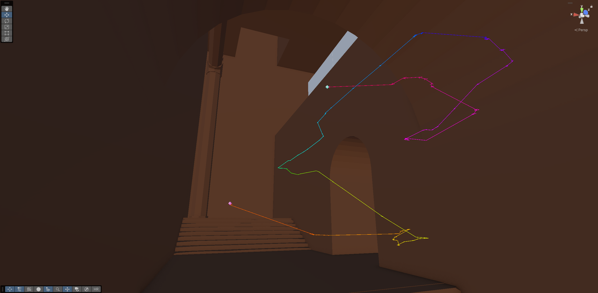
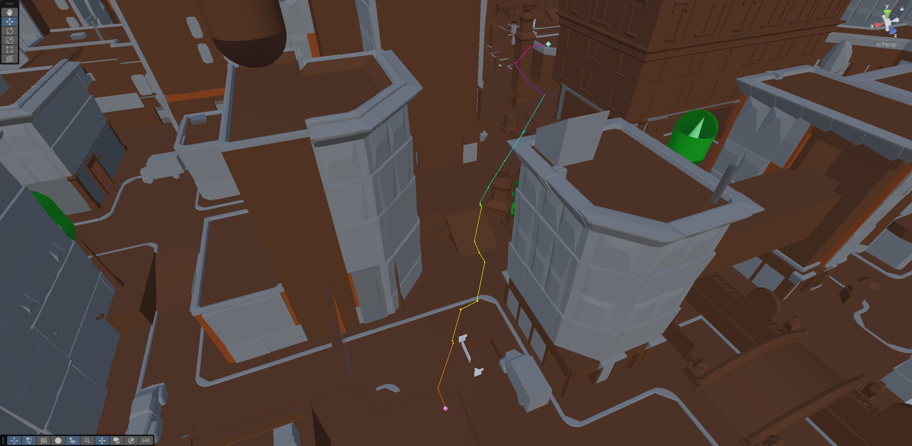
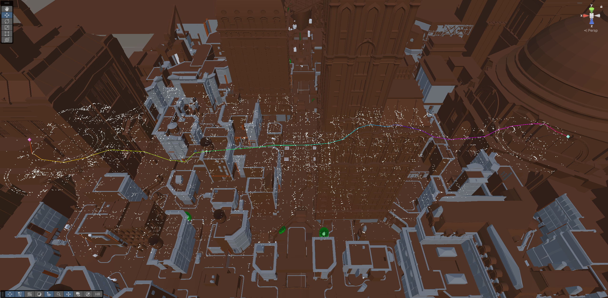
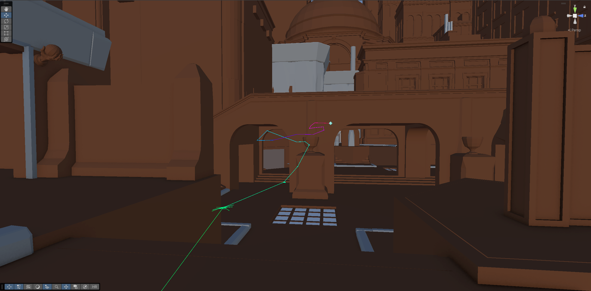

# Unity Port of Valve's Deadlock Map

Map extracted using Source2Viewer

This project was originally made to calculate navmesh distances between points on the map (eg. how long would it take to run from A to B), but then I repurposed it for the ["Urn Football Prototype"](https://youtu.be/K-rBDqrTnSY).

I wrote up my initial explorations in [this bluesky thread ](https://bsky.app/profile/ma.lloc.ca/post/3m6fpd2zos22l). 

Here are some screenshots of my pathfinding logic:

\
